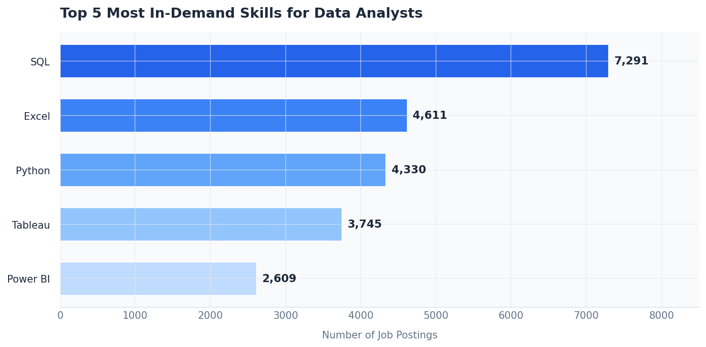
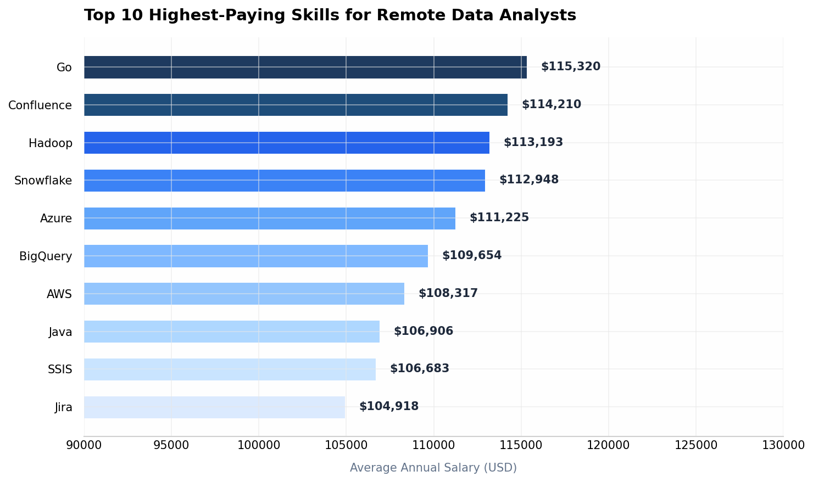
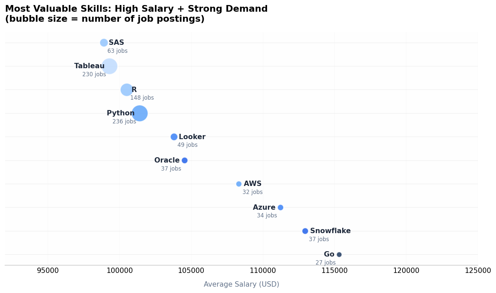
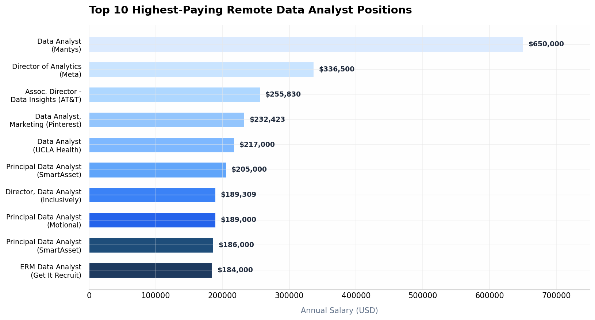
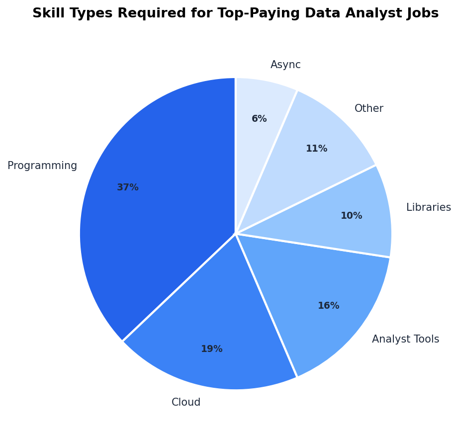

# Data Analyst Job Market: What's Actually Paying in 2023

I kept seeing the same advice online about breaking into data analytics. "Learn SQL, learn Python, learn Tableau." But nobody was talking about which skills actually move the salary needle, or which ones employers are really hiring for right now. So I dug into real job posting data to find out.

This project analyzes thousands of real Data Analyst job postings to figure out: what skills are in demand, what skills pay the most, and what combination of skills makes you the most hireable at the highest salary. I used SQL for all the analysis, working with a dataset that includes job titles, salaries, locations, and required skills.

---

## What I Built

Five SQL queries that answer specific, practical questions about the Data Analyst job market:

| Query | What It Answers |
|-------|-----------------|
| `top_paying_jobs.sql` | The 10 highest-paying remote Data Analyst positions and who's hiring |
| `top_skills_for_job.sql` | Which specific skills are required for those top-paying roles |
| `top_skills_on_salary.sql` | Skills ranked purely by average salary |
| `top_demand_skills.sql` | The 5 skills that appear most often in job postings |
| `most_valuable_skill.sql` | The real sweet spot: skills that are both high-paying AND in demand |

The database has a pretty standard structure: `job_postings_fact` as the main table, joined with `skills_job_dim` and `skills_dim` to map skills to each job, plus `company_dim` for employer info. I filtered for remote/hybrid roles with reported salaries to keep the numbers honest.

---

## Tools I Used

- **SQL** — all analysis done with CTEs, JOINs, aggregate functions, and subqueries
- **PostgreSQL** — the database engine handling the heavy lifting
- **Python + Matplotlib** — for the visualizations you're seeing below

---

## What the Data Actually Shows

### The Skills Everyone Wants

SQL dominates. By a lot. Nearly 7,300 job postings mention it, which is almost 60% more than the runner-up. Excel is still surprisingly strong at #2, and Python rounds out the top three. Tableau and Power BI fill out the visualization slot.

The thing that jumped out at me: SQL isn't just a nice-to-have, it's the baseline. If you don't know it, you're cutting yourself off from most opportunities before you even start.

---

### What Pays the Most

Here's where it gets interesting. The highest-paying skills aren't necessarily the most common ones. Go tops the list at $115K average, followed by Confluence, Hadoop, Snowflake, and Azure. Cloud platforms (Snowflake, Azure, AWS, BigQuery) show up repeatedly in this list.

Notice what's missing from the top-paying list? Python and SQL. They're so common that their average gets pulled down by entry-level roles. The real money is in specialized skills that fewer people have.

---

### The Skills That Actually Matter

This is my favorite finding. I combined demand data with salary data to find skills that hit both criteria: well-paying AND actively hired for. A skill that pays $200K but shows up in 3 jobs isn't practical. A skill in 10,000 jobs that pays $40K isn't either.

Python stands out here. It pays ~$101K on average and appears in 236 job postings. That's a rare combination of high pay and real opportunity. Tableau is similar — slightly lower salary but massive demand with 230 postings. Cloud skills (Snowflake, Azure, AWS) cluster in the $108-113K range with solid demand.

---

### Who's Paying Top Dollar

The salary range for remote Data Analyst roles is wild. The top job at Mantys pays $650K, which is either an outlier or a very senior role with equity included. More realistically, Director-level positions at companies like Meta ($337K) and AT&T ($256K) show where the ceiling is for experienced analysts.

Principal Data Analyst roles at companies like SmartAsset and Motional sit around $185-205K, which feels like a solid benchmark for senior individual contributors.

---

### What Top-Paying Jobs Actually Require

I broke down the skills required for the top 10 highest-paying positions by category. Programming skills dominate at 37%, with cloud platforms at 19% and analyst tools at 16%.

The pattern is clear: the best-paying jobs want you to code (Python, SQL, R), know your way around cloud infrastructure (AWS, Azure, Snowflake), AND present findings effectively (Tableau, Power BI). It's the combination that commands the premium, not any single skill.

---

## Key Takeaways

1. **SQL is non-negotiable.** It's in virtually every posting. If you're learning one thing first, make it this.

2. **Python + Tableau is a powerful combo.** Python gives you the analysis muscle, Tableau gives you the storytelling. Together they appear across high-paying roles repeatedly.

3. **Cloud skills are your salary multiplier.** AWS, Azure, Snowflake — knowing one of these pushes you from the $80K range into six figures.

4. **Specialization pays.** General SQL/Python skills get you hired. Niche skills (Go, Hadoop, specific cloud platforms) get you paid more.

5. **The best jobs want breadth, not just depth.** The top-paying roles consistently ask for programming + cloud + visualization skills together.

---

## What I Learned

**CTEs are your friend.** I used Common Table Expressions heavily in this project, especially for the "most valuable skills" query where I needed to calculate both demand and salary metrics before joining them. They make complex queries readable and debuggable.

**Always filter out nulls early.** I learned to add `salary_year_avg IS NOT NULL` in my WHERE clauses right away. Nothing skews an average like silently including zero or null values.

**Real data is messier than tutorials.** Job titles aren't standardized. The same company posts roles under different names. "Data Analyst" and "Principal Data Analyst" and "Director of Analytics" all overlap. You have to make judgment calls about what to include and exclude, and document those choices.

**The obvious skills aren't always the profitable ones.** I went into this thinking Python would top the salary list. It didn't. The real insight is in the overlap between demand and pay, not either one alone.

**Join order matters for readability.** I found that starting from `job_postings_fact` and joining outward to skills and companies made the queries easier to follow than trying to build from dimension tables inward.

---

## The SQL Files

| File | Description |
|------|-------------|
| [`top_paying_jobs.sql`](sql_queries/top_paying_jobs.sql) | Highest-paying remote DA roles with company names |
| [`top_skills_for_job.sql`](sql_queries/top_skills_for_job.sql) | Skills breakdown for each top-paying position |
| [`top_skills_on_salary.sql`](sql_queries/top_skills_on_salary.sql) | Skills ranked by average salary, remote only |
| [`top_demand_skills.sql`](sql_queries/top_demand_skills.sql) | Most frequently requested skills in all DA postings |
| [`most_valuable_skill.sql`](sql_queries/most_valuable_skill.sql) | The overlap: high salary + high demand |

---

## How to Use This

If you're trying to break into data analytics or level up your current role, start with the [`most_valuable_skill.sql`](most_valuable_skill.sql) query results. Pick a skill from that list that you don't have yet, and build a project around it. That's what I'm doing next with Snowflake.

If you're hiring, the [`top_skills_for_job.sql`](top_skills_for_job.sql) query gives you a realistic picture of what the market actually expects at different salary levels.

---

*Data sourced from real 2023 job postings. Salaries are average annual compensation in USD for remote/hybrid positions.*
